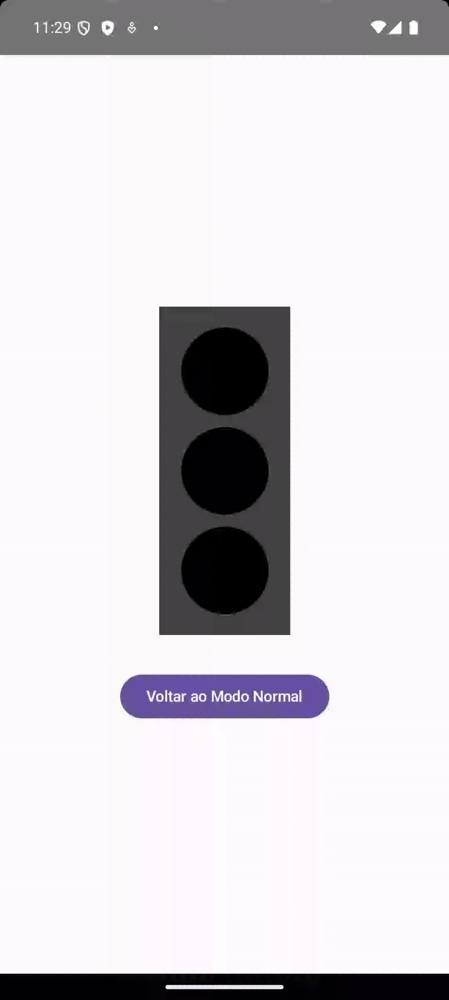

# Corrotinas do Kotlin no App de Semáforo

## O que são corrotinas?
As corrotinas do Kotlin são uma solução para programação assíncrona que permite escrever código sequencial que executa de forma não-bloqueante. Elas são especialmente úteis para operações que podem demorar, como temporizações ou chamadas de rede.

## Elementos de corrotinas no exemplo:

### `rememberCoroutineScope()`
Esta função cria um escopo de corrotina vinculado ao ciclo de vida do composable. Quando o composable é removido da composição, todas as corrotinas lançadas neste escopo são automaticamente canceladas.

### `LaunchedEffect`
Um efeito colateral do Compose que lança uma corrotina quando entra na composição e a cancela quando sai. No exemplo, usamos:

```kotlin
LaunchedEffect(modoPiscante) {
    // código da corrotina
}
```

O parâmetro `modoPiscante` faz com que a corrotina seja relançada sempre que esse valor mudar.

### `delay()`
Uma função suspensa (suspend function) que pausa a corrotina pelo tempo especificado sem bloquear a thread principal. Usamos para controlar os tempos de cada estado:

```kotlin
delay(3000) // Pausa por 3 segundos
```

### Loops infinitos com corrotinas
No exemplo, usamos loops `while(true)` dentro de corrotinas. Em programação tradicional, isso travaria a UI, mas com corrotinas isso é seguro porque `delay()` é uma função suspensa que libera a thread para outras operações.

## Benefícios das corrotinas no app:

- **Não bloqueia a UI**: As temporizações ocorrem em segundo plano.
- **Código sequencial**: Podemos escrever o código da lógica do semáforo de forma linear e fácil de entender.
- **Cancelamento automático**: As corrotinas são automaticamente canceladas quando não são mais necessárias.
- **Sincronização com o estado da UI**: As corrotinas são relançadas quando `modoPiscante` muda.

## Demonstração do Semáforo 🚦

<div align="center">

</div>
